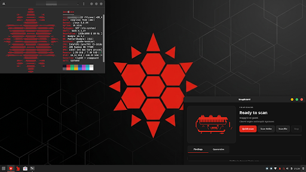
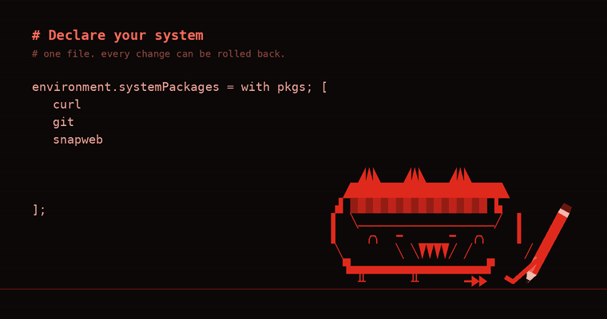
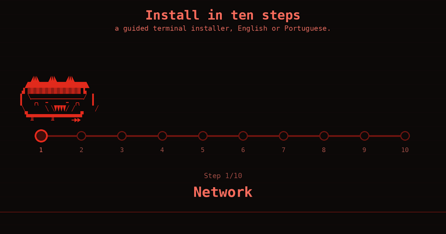
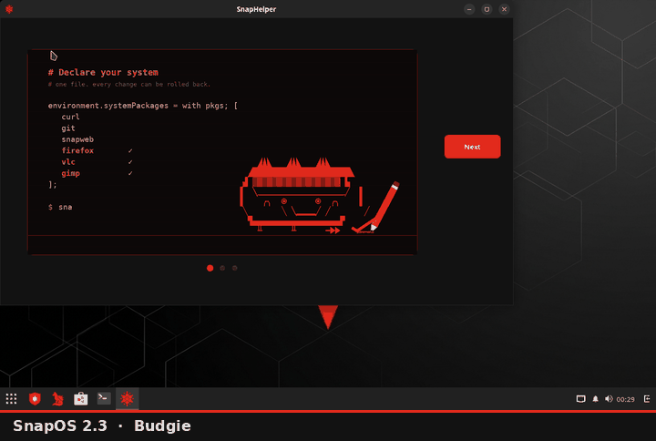
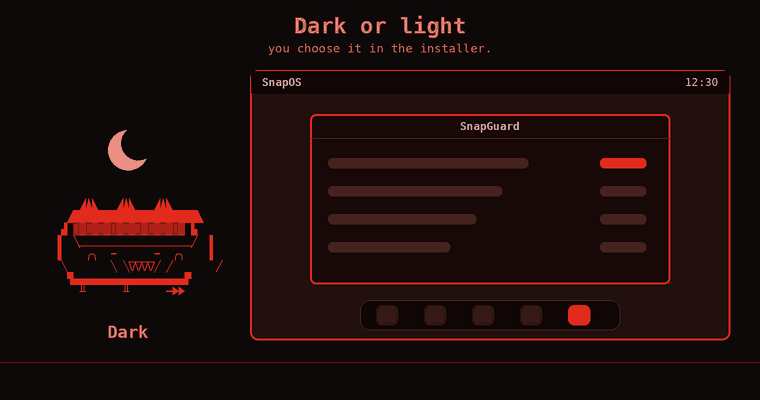
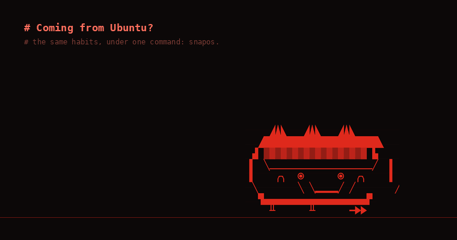
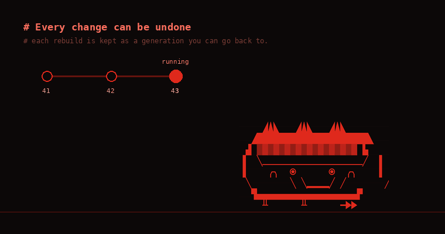
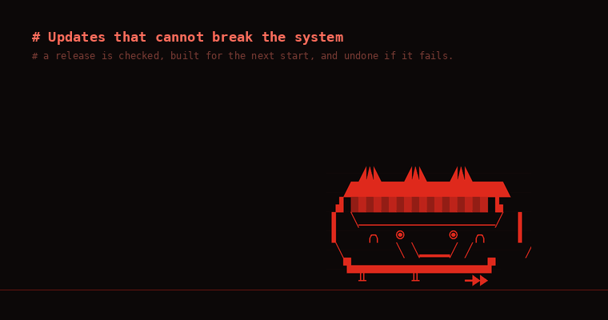
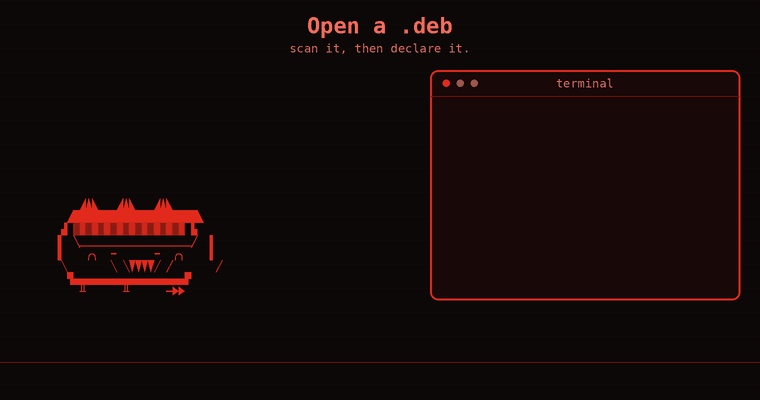
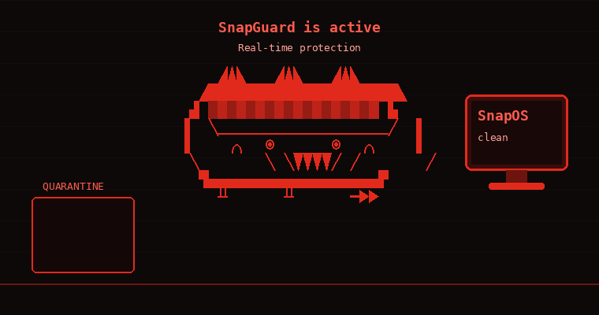

<p align="center">
  
</p>

<h1 align="center">SnapOS</h1>

<p align="center">
  <b>The easy road to NixOS.</b><br>
  Keep the habits you have from Debian-based distros. Get a system you can always undo.
</p>

<p align="center">
  <a href="#install">Install</a> ·
  <a href="#coming-from-a-debian-based-distro">Coming from a Debian-based distro</a> ·
  <a href="#every-command">Commands</a> ·
  <a href="#learning-nixos-from-here">Learn NixOS</a>
</p>

<br>

<a name="before-you-install"></a>

> [!NOTE]
> **This is the staging repository for SnapOS.** New features and fixes are developed and tested here first. When an update is verified it is carried over to [SnapOS](https://github.com/Juco7L7/SnapOS), the repository that ships the installer ISO.

> [!CAUTION]
> **Flash with balenaEtcher.** Do not copy the file onto the drive by hand, and
> do not use "ISO mode" tools (in Rufus, choose *DD Image mode*). If the boot
> stops with `unable to read id index table`, the download or the USB drive is
> damaged: compare the SHA-256 of the file with the one on the release page,
> then download and flash again.

> [!WARNING]
> **Do not use versions before V2.0** (V1 and V1.1). Their base stopped
> receiving security fixes on 30 June 2025. V2.0 and later run NixOS 26.05 with
> Linux 6.18 and update themselves.

<br>

## What is SnapOS?

SnapOS is **NixOS underneath and an everyday desktop on top**.

NixOS is a Linux system that describes itself in one file and can undo any
change. That is powerful, but its commands and its language are a wall for
someone who comes from Ubuntu, Mint or Debian.

SnapOS is the bridge. You keep the habits you already have (install, remove,
search, update) under one command, `snapos`. Behind each one SnapOS shows you
the NixOS way, so you can cross over at your own pace.

<br>

## Contents

| Part | What is in it |
| --- | --- |
| **1. Meet SnapOS** | [The idea](#the-idea-you-declare-you-do-not-install) · [What you get](#what-you-get) |
| **2. Get SnapOS** | [Install](#install) · [Desktops](#desktops) · [Dark or light](#dark-or-light) |
| **3. Use SnapOS** | [Coming from a Debian-based distro](#coming-from-a-debian-based-distro) · [Installing programs](#installing-programs) · [Changing the system](#changing-the-system) · [Undoing and cleaning](#undoing-and-cleaning) · [Updates](#updates) · [Debian packages](#debian-packages-deb) · [SnapGuard](#snapguard) |
| **4. Reference** | [Every command](#every-command) · [Learning NixOS from here](#learning-nixos-from-here) · [Build it yourself](#build-it-yourself) · [Repository layout](#repository-layout) |

<br>
<br>

# Part 1 · Meet SnapOS

<br>

## The idea: you declare, you do not install

<p align="center">
  
</p>

On most systems you install things one by one, and the computer slowly turns
into a pile of changes nobody remembers.

SnapOS is **declarative**:

- **One file**, `configuration.nix`, lists what the system is: its programs,
  services, look and settings.
- **A rebuild** makes the computer match the file.
- **Every rebuild is kept** as a *generation*, so you can always go back to the
  system you had before.

Add a name to the list and rebuild: the program is there. Remove the name and
rebuild: it is gone, with nothing left behind.

> **You do not have to edit the file by hand.** The `snapos` commands edit it
> and rebuild for you. Open it any time with `snapos config` to see what they
> wrote.

<br>

## What you get

| | |
| --- | --- |
| **Plain commands** | `snapos add`, `snapos remove`, `snapos rebuild`: they edit the system file for you |
| **An undo for everything** | each rebuild is a generation you can go back to, from the terminal or the boot menu |
| **Safe updates** | an update that does not start is undone by itself |
| **SnapGuard** | a defender based on ClamAV, in real time; nothing is deleted without your approval |
| **SnapWeb** | the browser: official Firefox with a dark and red look |
| **`.deb` support** | open a `.deb` and SnapOS scans it, then installs it in a real Debian layer |
| **Software** | GNOME Software with Flatpak and Flathub |
| **Four desktops** | Budgie, KDE Plasma, Xfce or Hyprland, each in dark or light |
| **A guided installer** | eleven steps, in English or Portuguese, for x86_64 and ARM64 |
| **SnapHelper** | a short tour that opens the first time you log in |

<br>
<br>

# Part 2 · Get SnapOS

<br>

## Install

<p align="center">
  
</p>

**Three steps:**

1. **Download** the ISO from the Releases page.

   | Your computer | File |
   | --- | --- |
   | A PC (x86_64, BIOS or UEFI) | `snapos-installer.iso` |
   | An ARM64 computer (UEFI) | `snapos-installer-aarch64.iso` |

2. **Flash** it to a USB drive with [balenaEtcher](https://etcher.balena.io).
3. **Boot** from the USB drive. The installer starts by itself.

The installer asks eleven things: network, keyboard, language, time zone, disk,
account, desktop, look (dark or light) and graphics, then shows a review before
it installs. The Wi-Fi network you choose is kept, so the installed system
connects by itself.

Already on SnapOS? Boot the installer and pick **Update SnapOS (keeps your
files)**.

Flash the image with balenaEtcher and read the [warnings at the top](#before-you-install) first.

<details>
<summary><b>ARM64 computers</b></summary>

<br>

The ARM64 image is for computers that boot by UEFI: ARM laptops, mini PCs and
boards with a UEFI firmware. It is the same SnapOS, and the system calls itself
`SnapOS ... ARM`.

Boards that need a vendor image instead of UEFI (most Raspberry Pi setups) are
not covered.

</details>

<details>
<summary><b>Installing without questions</b></summary>

<br>

A USB stick (or a small image) labelled `SNAPOS_ANSWERS` with a file
`snapos-answers.env` answers everything, and the installer runs on its own:

```
LANG=en
KEYMAP=us
LOCALE=en_US.UTF-8
TIMEZONE=UTC
DISK=sda
USERNAME=snap
PASSWORD=change-me
HOSTNAME=snapos
DESKTOP=budgie
LOOK=dark
GRAPHICS=auto
```

</details>

<br>

## Desktops

<p align="center">
  
</p>

The installer asks which desktop you want:

| Desktop | For whom |
| --- | --- |
| **Budgie** (default) | simple and light, with a dock |
| **KDE Plasma** | full-featured and highly configurable |
| **Xfce** | classic and very light, good for older computers |
| **Hyprland** | tiling and keyboard-driven, Wayland only, for people who like that |

All four get the red icons, the SnapOS wallpaper, the same login screen, and
the same programs pinned: SnapGuard, SnapWeb, the programs store and the
terminal.

To switch later, change `snapos.desktop` in `/etc/snapos/local.nix` and run
`snapos rebuild`.

<details>
<summary><b>Hyprland keys</b></summary>

<br>

| Keys | What they do |
| --- | --- |
| Super + Enter | terminal |
| Super + D | launcher |
| Super + Q | close the window |
| Super + 1..9 | workspaces |
| Super + H | the minimized windows |
| Print | screenshot |

Windows have title bars with close, maximize and minimize.

</details>

<br>

## Dark or light

<p align="center">
  
</p>

The installer asks whether you want a dark or a light desktop. The theme,
icons, wallpaper, login screen, the SnapGuard shield and SnapWeb all follow it.

To switch later, change `snapos.appearance` in `/etc/snapos/local.nix` and run
`snapos rebuild`.

<br>
<br>

# Part 3 · Use SnapOS

<br>

## Coming from a Debian-based distro

<p align="center">
  
</p>

There is no `apt` on SnapOS. The same habits have these names:

| You used to type | On SnapOS | What happens |
| --- | --- | --- |
| `apt search vlc` | `snapos find vlc` | searches the programs SnapOS can install |
| `apt install vlc` | `snapos add vlc` | declares the program and rebuilds |
| `apt remove vlc` | `snapos remove vlc` | takes it out and rebuilds |
| `apt list --installed` | `snapos list` | the programs this system declares |
| `apt autoremove` | `snapos gc` | frees disk space |
| `apt upgrade` | `snapos update` | installs the latest release and newer packages |
| installing just to try | `snapos shell vlc` | uses it without installing |
| a `.deb` file | `snap-deb FILE.deb` | scans it and installs it in the Debian layer |

`snapos help` prints this list. `snapos` asks for root through `sudo` on its
own when a command needs it.

<br>

## Installing programs

<p align="center">
  
</p>

```bash
snapos find vlc        # look for it (the first search takes a minute)
snapos add vlc         # install it
snapos remove vlc      # uninstall it
snapos list            # what is installed
```

`snapos add` checks that the name exists before it touches anything. What it
writes is the same list you can edit by hand in `configuration.nix`:

```nix
environment.systemPackages = with pkgs; [
  curl
  git
  snapweb
  vlc
];
```

<br>

**Just trying something?**

```bash
snapos shell python3       # a shell that has the program; type exit and it is gone
snapos try cowsay hello    # runs a program once
```

Nothing is added to your system, and both use the same versions an install
would.

<br>

**Other places to get programs**

- **Software**: GNOME Software with Flatpak and Flathub.
- **A `.deb` file**: see [Debian packages](#debian-packages-deb).

<details>
<summary><b>Why not <code>nix-env -i</code>?</b></summary>

<br>

It looks like `apt install`, but what it installs is outside the system
description: rebuilds do not know it, updates skip it and it keeps disk space
alive. On SnapOS the shell stops `nix-env -i`, explains this and points to
`snapos add` and `snapos shell`.

</details>

<br>

## Changing the system

```bash
snapos config                 # open configuration.nix in your editor
snapos diff                   # what would change, without applying anything
snapos rebuild                # apply the configuration now
snapos rebuild --next-boot    # apply it at the next start only
snapos rebuild --trace        # show the full error when a build fails
snapos log                    # the output of the last rebuild
```

**Which rebuild?**

| You changed | Use | Why |
| --- | --- | --- |
| programs, settings, the look | `snapos rebuild` | applied to the running system |
| the kernel, drivers, the boot loader | `snapos rebuild --next-boot` | the running system is left alone; a bad change cannot take the screen away while you work |

**When a rebuild fails** the system is not changed. Nix error messages are
short; `snapos rebuild --trace` shows where the error comes from.

**Where things live**

| Path | What |
| --- | --- |
| `/etc/snapos/configuration.nix` | your programs and settings |
| `/etc/snapos/local.nix` | what the installer chose: desktop, look, keyboard, user |
| `/etc/nixos` | points to `/etc/snapos`, so NixOS tools work too |

<br>

## Undoing and cleaning

<p align="center">
  
</p>

```bash
snapos generations     # the systems you can go back to
snapos rollback        # go back to the system before the last rebuild
snapos gc              # free disk space: drop systems older than 14 days
snapos gc --all        # keep only the current system
```

**The desktop does not come up?** Restart and pick an older system in the boot
menu. Every generation is an entry there.

**Disk filling up?** Generations take space, which is the usual surprise for
someone new to NixOS. SnapOS removes generations older than 14 days every week
on its own. `snapos gc` does it now and says how much space it freed.

> After a rollback your files in `/etc/snapos` still hold the change that was
> undone. Fix it with `snapos config` before the next rebuild.

<br>

## Updates

<p align="center">
  
</p>

At every login SnapOS looks for two things:

| What | Where it comes from |
| --- | --- |
| **A newer SnapOS release** | the Releases page |
| **Newer packages**: the desktop you chose, the browser, the kernel and the rest, with their security fixes | the NixOS branch SnapOS is built from |

If there is something new, a window offers **Install now**. You can also run
`snapos update` yourself at any time.

**It cannot break your system:**

1. The new system is built for the **next start** only. What is running is not
   touched.
2. After the restart the new system gets **one try**. It is approved the moment
   you log in.
3. If it never reaches the login screen, SnapOS **goes back by itself** on the
   next start and tells you at login.

<details>
<summary><b>The four steps of <code>snapos update</code></b></summary>

<br>

1. **Checking**: the computer is x86_64 or aarch64, `/nix` has room, the
   release is not older than the installed one (`--force` overrides), and the
   release ships its source package with a checksum.
2. **Downloading**: the source package is fetched and its SHA-256 compared
   with the checksum the release carries; a mismatch stops everything.
3. **Keeping your files**: `configuration.nix`, `local.nix`, the hardware
   file, the graphics mode and your `.deb` files are carried over.
4. **Building the next system**: the new system is built and made the default
   for the next start.

</details>

<details>
<summary><b>More about updates</b></summary>

<br>

- **Packages** are offered when the ones you have are more than a week old and
  newer ones exist. A later SnapOS release never brings older packages than
  the ones you already have.
- **One release for every computer.** An update does not download an image: it
  downloads the release's source and builds the system for the computer it
  runs on, so an x86_64 PC and an ARM64 computer update from the same release.
- **Until you restart**, the login window says the update is installed and
  offers **Restart now**.
- **No network?** The window says it could not check, instead of claiming the
  system is up to date.
- **Nothing new at login?** The check asks again every few hours while you
  are logged in.
- `snapos update check` only asks; `snapos version` shows what is running.

</details>

<br>

## Debian packages (.deb)

<p align="center">
  
</p>

Programs that only exist as a `.deb` work too. **Double-click the file**, or
run `snap-deb FILE.deb`.

```bash
snap-deb list                   # declared .deb files and their state
snap-deb remove discord         # take one out (then: snapos rebuild)
snap-deb run discord            # start a program from the layer by hand
snap-deb shell                  # a shell inside the Debian layer
snap-deb status                 # the layer: Debian version, packages, tools
```

<details>
<summary><b>What happens when you open a <code>.deb</code></b></summary>

<br>

1. **SnapGuard scans the file.** A threat goes to quarantine and nothing is
   installed. A file that cannot be scanned is refused unless you insist.
2. **The file is declared**: copied to `/etc/snapos/debs/`. A newer version of
   the same package replaces the older one.
3. **The rebuild installs it in the Debian layer**, a small real Debian
   (Debian 13) in `/var/lib/snapdeb`. It is created the first time you add a
   `.deb`, from the official Debian archive with its signatures checked, and
   downloads about 300 MB once. Inside it, Debian's own `apt` installs the
   package and the libraries it needs.
4. **The program is exported**: its menu entry, icon and command appear on the
   desktop like any other. It runs inside the layer with your home folder,
   screen, sound and settings.

</details>

<details>
<summary><b>What the layer does not do</b></summary>

<br>

- **It runs programs, not services.** A `.deb` that installs a system service
  (a VPN, Docker, a driver) is refused with a message, because it would
  install but never work. Look for that software with `snapos find` instead.
- **It is not a sandbox.** A program in it reads and writes your files like a
  native one, which is why SnapGuard scans every `.deb` first.
- On an ARM64 computer the layer takes `arm64` packages. On a PC it takes
  64-bit and 32-bit packages, so programs like **Steam** work: its libraries
  are installed together with it.

</details>

<br>

## SnapGuard

<p align="center">
  
</p>

SnapGuard is the defender. It combines ClamAV, a SnapOS hash list and a trust
list.

- **In real time.** From the moment you log in, every file that lands in
  `Downloads` is scanned as soon as it is complete, and a USB drive is scanned
  when you plug it in.
- **Threats are contained, not deleted.** The file goes to quarantine and its
  execute bits are removed. You then choose to keep and trust it, or to delete
  it.

```bash
snapguard                       # the window: quick scan, folders, quarantine
snapguard scan ~/Downloads      # scan from the command line
snapguard status                # engine, database and real-time protection
snapguard list                  # what is in quarantine
snapguard restore NAME          # or: delete NAME, trust PATH
```

The virus database downloads on the first boot with internet. See
[docs/SECURITY.md](docs/SECURITY.md) for the design.

<br>
<br>

# Part 4 · Reference

<br>

## Every command

**The system**

| Command | Description |
| --- | --- |
| `snapos find NAME` | search for a program |
| `snapos add NAME` / `remove NAME` | install or uninstall |
| `snapos list` | the programs this system declares |
| `snapos shell NAME` / `try NAME` | use a program without installing it |
| `snapos config` | open `configuration.nix` in your editor |
| `snapos diff` | what a rebuild would change |
| `snapos rebuild` | apply the configuration (`--next-boot`, `--trace`) |
| `snapos rollback` / `generations` | go back, or list what you can go back to |
| `snapos gc` | free disk space (`--all` keeps only the current system) |
| `snapos log` | the output of the last rebuild |
| `snapos update` / `update check` | releases and package updates |
| `snapos version` | the release this system runs |
| `snapos doctor` | check graphics, boot, network and antivirus problems |
| `snapos help` | the list of commands |

**Programs from other places**

| Command | Description |
| --- | --- |
| `snap-deb FILE.deb` | scan a `.deb`, then add it |
| `snap-deb list` / `remove NAME` | the `.deb` files you added |
| `snap-deb run CMD` / `shell` / `status` | the Debian layer |
| `snapctl run PROGRAM` | run a program and draft it for the declaration |
| `snapctl save` / `discard` / `status` | keep or drop drafted programs |

**The rest**

| Command | Description |
| --- | --- |
| `snapguard`, `snapguard scan PATH`, `snapguard status` | the defender |
| `snapweb` | the web browser |
| `snaphelper` | the tour that opens at the first login |
| `snappy` / `snappy feed` / `snappy pet` | the mascot |
| `fastfetch` | system information |

<br>

## Learning NixOS from here

Each `snapos` command is a short name for a NixOS command. When you are ready
for the real ones, they work on SnapOS too:

| SnapOS | What it runs |
| --- | --- |
| `snapos rebuild` | `nixos-rebuild switch --flake path:/etc/snapos#snapos` |
| `snapos rebuild --next-boot` | `nixos-rebuild boot --flake ...` |
| `snapos rebuild --trace` | `nixos-rebuild switch --flake ... --show-trace` |
| `snapos diff` | `nixos-rebuild build`, then `nix store diff-closures` |
| `snapos rollback` | `nixos-rebuild switch --rollback` |
| `snapos generations` | `nixos-rebuild list-generations` |
| `snapos gc` | `nix-collect-garbage --delete-older-than 14d` |
| `snapos gc --all` | `nix-collect-garbage -d` |
| `snapos find NAME` | `nix search` |
| `snapos shell NAME` | `nix shell` |
| `snapos try NAME` | `nix run` |
| `snapos add NAME` | a line in `environment.systemPackages`, then a rebuild |
| `snapos update` (packages) | `nix flake update nixpkgs`, then `nixos-rebuild boot` |

On ARM64 the system is `snapos-aarch64` instead of `snapos`. Options for
`configuration.nix` are listed at [search.nixos.org](https://search.nixos.org).

<br>

## Build it yourself

You need Nix with flakes enabled.

```bash
nix build .#iso             # the installer image of this machine's architecture
nix build .#toplevel        # the installed system
make all gui && make test   # the C tools and their tests
```

Apps that SnapOS ships in its own version live in [`custom-apps/`](custom-apps/).
Each folder there becomes a package automatically; SnapWeb is one of them.

**What CI checks before a release**

- both images build (x86_64 and ARM64);
- every desktop boots in a virtual machine, in both looks, through the login
  screen;
- on ARM64, SnapOS is installed without questions in a virtual machine and the
  installed system boots.

<br>

## Repository layout

| Path | Contents |
| --- | --- |
| `configuration.nix` | the system declaration and the program list |
| `flake.nix` | the systems and images for x86_64 and ARM64, the package set, checks |
| `nix/modules/` | desktops, theme, defender, hardware and defaults |
| `nix/iso.nix` | the installer image |
| `nix/installer/` | the installer |
| `nix/pkgs/` | SnapOS packages: tools, SnapGuard window, icons, wallpapers |
| `nix/tests/` | virtual machine tests |
| `custom-apps/` | apps SnapOS ships in its own version (SnapWeb) |
| `src/` | the C tools |
| `security/` | SnapGuard signature list, allowlist and the Debian archive keyring |
| `docs/` | the security design, release notes and pictures |
| `branding/` | logo, icons, wallpapers, animations, fastfetch configuration |
| `tests/` | tests for the C tools and the repository |
| `.github/workflows/` | ISO builds, desktop tests, release workflows |

<br>

## License

MIT, see [LICENSE](LICENSE).

<br>

---

<p align="center">
  SnapOS was created as the final project (TCC) of a 15-year-old student.<br>
  The goal: total control of your system, strong built-in security, and a
  friendlier learning curve than Nix.
</p>

<p align="center"><sub>AI assisted (Sonnet 5, Fable 5.1)</sub></p>
